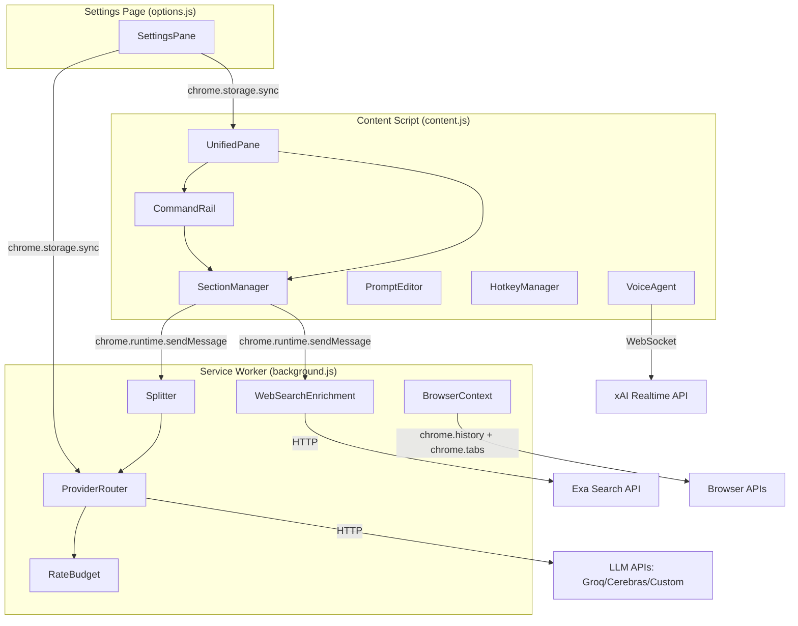
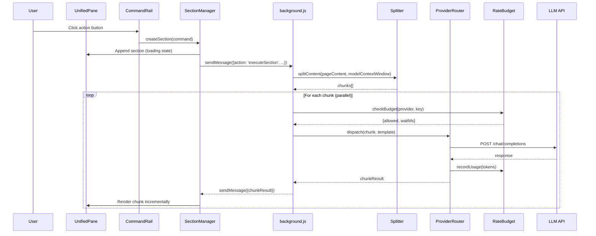

# Design Document: pzdrk v7.0 Overhaul

## Overview

pzdrk v7.0 is a major architectural overhaul of the Chrome Extension (Manifest V3) that replaces the multi-note floating UI with a unified single-pane layout, introduces a parallel multi-stream LLM pipeline with rate budget tracking, and consolidates all configuration into a single settings pane. The extension remains vanilla ES2022 JavaScript with no build step.

The overhaul touches every layer of the extension:
- **UI Layer** (content.js + content.css): Replace `createNote()` floating notes with a single `UnifiedPane` containing inline collapsible sections, a command rail, and a sticky section navigator.
- **LLM Pipeline** (background.js): New `ProviderRouter` with parallel chunk dispatch, per-key rate budget tracking (TPM/RPM), custom OpenAI-compatible provider support, and per-command model overrides.
- **Settings** (options.js + options.html): Unified tabbed settings pane covering providers, prompts, buttons, shortcuts, voice, formatting, and privacy — with import/export and live rate dashboard.
- **Voice** (content.js WebSocket): Fix Grok voice agent reliability — reconnection with exponential backoff, token refresh, connection status indicator.

### Key Design Decisions

1. **No build step** — all code remains vanilla JS/CSS loaded directly by Chrome. No bundler, no transpiler.
2. **Message passing architecture preserved** — content.js ↔ background.js communication stays via `chrome.runtime.sendMessage` / `chrome.runtime.onMessage`.
3. **Storage split preserved** — `chrome.storage.sync` for settings (≤100KB), `localStorage` for page cache.
4. **Backward compatibility** — existing user settings (API keys, tags, prompts) migrate automatically on first v7 load.

## Architecture

### High-Level Component Diagram



### Request Flow



### File Responsibility Changes

| File | v6 Responsibility | v7 Changes |
|------|-------------------|------------|
| `content.js` | Floating notes, prompts, UI, voice | UnifiedPane, SectionManager, CommandRail, HotkeyManager, VoiceAgent (refactored) |
| `background.js` | Simple LLM proxy, key rotation | ProviderRouter, RateBudget, Splitter, BrowserContext, WebSearchEnrichment |
| `options.js` | Basic provider/key settings | Full tabbed SettingsPane with 8 tabs |
| `options.html` | Simple form | Tabbed layout with live dashboard |
| `content.css` | Note glassmorphism styles | UnifiedPane glassmorphism, section styles, command rail |
| `manifest.json` | No changes needed | Same permissions suffice |

## Components and Interfaces

### 1. UnifiedPane (content.js)

Replaces the `createNote()` multi-note system with a single draggable, resizable pane.

```javascript
// UnifiedPane API
const UnifiedPane = {
  init(),                          // Create and inject the pane DOM
  show(),                          // Make visible
  hide(),                          // Hide
  addSection(sectionConfig),       // Append a new Section
  removeSection(sectionId),        // Remove a Section
  collapseSection(sectionId),      // Collapse to header only
  expandSection(sectionId),        // Expand to full content
  scrollToSection(sectionId),      // Scroll + highlight
  getPosition(),                   // {x, y, width, height}
  setPosition({x, y, w, h}),      // Reposition and persist
  destroy()                        // Tear down
};
```

**DOM Structure:**
```html
<div class="pzdrk-unified-pane">
  <div class="pzdrk-pane-header"><!-- drag handle, minimize, close --></div>
  <div class="pzdrk-pane-body">
    <nav class="pzdrk-section-nav"><!-- sticky sidebar with section links --></nav>
    <div class="pzdrk-sections-container">
      <!-- Sections rendered here -->
    </div>
  </div>
  <div class="pzdrk-command-rail"><!-- Action buttons --></div>
</div>
```

### 2. SectionManager (content.js)

Manages the lifecycle of inline sections within the UnifiedPane.

```javascript
// Section object shape
const Section = {
  id: 'section_abc123',
  type: 'summary' | 'translate' | 'mindmap' | 'custom' | 'voice',
  title: 'СУТЬ',
  status: 'loading' | 'streaming' | 'complete' | 'error',
  collapsed: false,
  tokenCount: 0,
  content: '',           // Rendered HTML
  rawContent: '',        // Raw markdown/JSON from LLM
  templateId: 'summary', // Reference to Section_Template
  chunks: [],            // Partial results from parallel pipeline
  createdAt: Date.now()
};

const SectionManager = {
  createSection(command, templateId),
  updateSectionChunk(sectionId, chunkIndex, content),
  finalizeSection(sectionId),
  getSections(),
  clearAll()
};
```

### 3. CommandRail (content.js)

Vertical strip of action buttons on the right side of the UnifiedPane.

```javascript
const CommandRail = {
  init(container),
  render(commands),          // Render built-in + custom buttons
  addCustomButton(config),
  removeCustomButton(id),
  reorderButtons(orderedIds),
  getCommands()
};

// Button config shape
const ButtonConfig = {
  id: 'custom_abc',
  label: 'My Action',
  icon: '🔬',
  prompt: 'Analyze {content} for...',
  system: '',                    // Optional system prompt override
  scope: 'page' | 'selection',
  provider: null,                // null = use default
  model: null,                   // null = use default
  hotkey: null,                  // Optional hotkey binding
  order: 5
};
```

### 4. ProviderRouter (background.js)

Routes LLM requests to the optimal provider/key based on configuration and rate budget.

```javascript
// ProviderRouter API (background.js message handlers)
const ProviderRouter = {
  // Dispatch a single LLM request
  async dispatch({ messages, template, providerOverride, modelOverride, maxTokens }),

  // Dispatch multiple chunks in parallel
  async dispatchParallel({ chunks, template, providerOverride, modelOverride, maxParallel }),

  // Register a custom provider
  registerProvider({ name, baseUrl, apiKeys, models, tpmLimit, rpmLimit }),

  // Get current provider status
  getProviderStatus(providerName)
};
```

### 5. RateBudget (background.js)

Tracks per-provider, per-key TPM/RPM consumption using sliding windows.

```javascript
const RateBudget = {
  // Check if a request can proceed
  checkBudget(provider, key) -> { allowed: boolean, waitMs: number },

  // Record token usage after a successful request
  recordUsage(provider, key, { promptTokens, completionTokens }),

  // Get current usage stats (for settings dashboard)
  getUsageStats(provider) -> { tpmUsed, tpmLimit, rpmUsed, rpmLimit, perKeyStats },

  // Update limits from settings
  updateLimits(provider, { tpmLimit, rpmLimit })
};

// Internal: sliding window of 60-second buckets
// Each bucket: { timestamp, tokens, requests }
```

### 6. Splitter (background.js)

Divides page content into chunks for parallel processing.

```javascript
const Splitter = {
  // Split content into chunks
  split(content, { modelContextWindow, templateOverhead, targetChunkTokens }) -> string[],

  // Estimate tokens (reuse existing estimateTokens logic)
  estimateTokens(text) -> number
};
```

### 7. BrowserContext (background.js)

Aggregates browsing history, open tabs, and navigation pathway.

```javascript
const BrowserContext = {
  async collect({ historyDays, historyLimit, includeTabs, includePathway }) -> {
    history: [{ title, url, visitTime }],
    tabs: [{ title, url, windowId }],
    pathway: [{ title, url }]   // Referrer chain
  }
};
```

### 8. WebSearchEnrichment (background.js)

Fetches Exa search results and formats them for prompt injection.

```javascript
const WebSearchEnrichment = {
  async enrich(pageTitle, topics, { maxResults: 5 }) -> string  // Formatted snippet text
};
```

### 9. HotkeyManager (content.js)

Manages keyboard shortcut bindings and execution.

```javascript
const HotkeyManager = {
  init(),
  registerHotkey(commandId, keyCombination),
  unregisterHotkey(commandId),
  getConflicts(keyCombination) -> commandId | null,
  resetAll(),
  getMap() -> { [commandId]: keyCombination }
};

// Key combination format: "Ctrl+Shift+S", "Alt+M", "Meta+K"
```

### 10. VoiceAgent (content.js)

Refactored Grok voice agent with reliability improvements.

```javascript
const VoiceAgent = {
  async connect(),                    // Establish WebSocket, 5s timeout
  disconnect(),
  getStatus() -> 'disconnected' | 'connecting' | 'connected' | 'reconnecting',
  async startPushToTalk(),
  stopPushToTalk(),
  onTranscript(callback),            // Register transcript listener
  onStatusChange(callback)           // Register status listener
};

// Reconnection: exponential backoff 1s, 2s, 4s — max 3 attempts
// Token refresh: auto-request fresh token on 401/expired
```

### 11. SettingsPane (options.js)

Unified tabbed settings interface.

```javascript
// Tab structure
const SETTINGS_TABS = [
  'general',     // Default provider, model, auto-summarize, privacy
  'providers',   // Provider configs, API keys, rate limits, custom providers
  'prompts',     // All prompt templates grouped by category
  'buttons',     // Custom button management (add/edit/delete/reorder)
  'shortcuts',   // Hotkey bindings with record UI
  'voice',       // Grok voice config
  'formatting',  // Semantic markup styles, font, colors
  'privacy'      // Tracker blocking, history inclusion toggles
];
```

### Message Passing Protocol (content.js ↔ background.js)

New message types added to the existing `chrome.runtime.sendMessage` protocol:

```javascript
// Content → Background
{ action: 'executeSection', command, template, chunks, providerOverride, modelOverride }
{ action: 'getBrowserContext', historyDays, historyLimit }
{ action: 'exaSearch', query }
{ action: 'getProviderStatus', provider }
{ action: 'getRateBudgetStats' }

// Background → Content (via response callback or chrome.tabs.sendMessage)
{ action: 'sectionChunkResult', sectionId, chunkIndex, content, done }
{ action: 'sectionError', sectionId, error }
```

## Data Models

### Settings Schema (chrome.storage.sync)

```javascript
const SettingsSchema = {
  // General
  coreProvider: 'groq',                    // Default provider
  coreModel: 'moonshotai/kimi-k2-instruct-0905',  // Default model
  autoSummarize: true,
  classicMode: false,
  tags: ['#dev', '#llm'],

  // Providers
  providers: {
    groq: {
      apiKeys: ['gsk_...'],               // Multiple keys
      models: ['moonshotai/kimi-k2-instruct-0905'],
      tpmLimit: 6000,
      rpmLimit: 30,
      baseUrl: 'https://api.groq.com/openai/v1/chat/completions'
    },
    cerebras: {
      apiKeys: [],
      models: ['gpt-oss-120b', 'llama-3.3-70b'],
      tpmLimit: 60000,
      rpmLimit: 30,
      baseUrl: 'https://api.cerebras.ai/v1/chat/completions'
    }
    // Custom providers added here with same shape
  },

  // Per-command overrides
  commandOverrides: {
    summary: { provider: null, model: null },
    translate: { provider: null, model: null },
    mindmap: { provider: null, model: null },
    deepdive: { provider: null, model: null }
    // Custom button IDs also appear here
  },

  // Section Templates
  sectionTemplates: {
    summary: {
      systemPrompt: '...',
      userPromptTemplate: '...',
      outputFormat: 'json',           // 'markdown' | 'json' | 'list'
      targetTokenCount: 1200,
      structuralConstraints: {
        headings: ['СУТЬ', 'КАРТА', 'КЛЮЧЕВЫЕ ТЕЗИСЫ', ...],
        bulletDepth: 3,
        columnLayout: 'two-column'
      }
    }
    // One entry per section type
  },

  // Custom Buttons
  customButtons: [
    {
      id: 'custom_abc',
      label: 'My Action',
      icon: '🔬',
      prompt: '...',
      system: '',
      scope: 'page',
      provider: null,
      model: null,
      hotkey: null,
      order: 0
    }
  ],

  // Hotkeys
  hotkeyMap: {
    summarize: 'Alt+S',
    translate: 'Alt+T',
    mindmap: 'Alt+M',
    voiceToggle: 'Alt+V',
    commandPalette: 'Alt+K',
    custom_abc: 'Ctrl+Shift+1'
  },

  // Voice
  voiceProvider: 'xai',
  voiceChatMode: 'off',
  voicePersonality: 'Ara',
  autoSpeakSummary: false,
  pushToTalkHotkey: 'Space',
  voiceConnectionTimeout: 5000,

  // Formatting
  formatting: {
    fontSize: 14,
    colorScheme: 'auto',              // 'auto' | 'dark' | 'light'
    semanticMarkupStyles: {
      entity: { color: '#4fc3f7', underline: true },
      term: { color: '#81c784', italic: true },
      wiki: { color: '#ffb74d', underline: true },
      evidence: { color: '#e57373', bold: true },
      action: { color: '#ba68c8', bold: true }
    }
  },

  // Privacy
  privacyEnabled: true,
  historyIntegration: {
    enabled: true,
    days: 14,
    maxEntries: 200,
    perCommandOverrides: {}           // { summary: false, translate: true }
  },

  // Web Search
  webSearchEnabled: true,
  webSearchPerCommand: {},            // { summary: true, translate: false }
  exaApiKey: '',

  // Pipeline
  maxParallelRequests: 12,
  targetMaxOutputTokens: 500
};
```

### RateBudget Internal State (in-memory, background.js)

```javascript
const RateBudgetState = {
  // Per provider, per key
  'groq': {
    'gsk_key1': {
      tpmBuckets: [{ ts: 1700000000, tokens: 500 }, ...],  // 60s sliding window
      rpmBuckets: [{ ts: 1700000000, requests: 1 }, ...],
      cooldownUntil: 0
    }
  }
};
```

### Section Runtime State (in-memory, content.js)

```javascript
const SectionState = {
  sections: [
    {
      id: 'sec_001',
      type: 'summary',
      title: '📌 СУТЬ',
      status: 'complete',
      collapsed: false,
      tokenCount: 847,
      content: '<div>...</div>',
      rawContent: '...',
      templateId: 'summary',
      chunks: [
        { index: 0, status: 'complete', content: '...' },
        { index: 1, status: 'complete', content: '...' }
      ],
      createdAt: 1700000000000
    }
  ],
  panePosition: { x: 20, y: 60, width: 800, height: 600 }
};
```

### Migration Strategy (v6 → v7)

On first v7 load, a migration function reads existing v6 settings and maps them:

| v6 Key | v7 Key |
|--------|--------|
| `coreProvider` | `coreProvider` (unchanged) |
| `groqApiKey` / `groqApiKeys` | `providers.groq.apiKeys` |
| `cerebrasApiKeys` | `providers.cerebras.apiKeys` |
| `model` / `modelGroq` | `providers.groq.models[0]` + `coreModel` |
| `modelCerebras` | `providers.cerebras.models[0]` |
| `summaryPrompt` | `sectionTemplates.summary.userPromptTemplate` |
| `summaryJsonPrompt` | `sectionTemplates.summaryJson.userPromptTemplate` |
| `sectionEnrichPrompt` | `sectionTemplates.sectionEnrich.userPromptTemplate` |
| `actionPrompts` | `customButtons[]` |
| `maxParallelRequests` | `maxParallelRequests` (unchanged) |
| `targetMaxOutputTokens` | `targetMaxOutputTokens` (unchanged) |

A `settingsVersion` key tracks migration state. Migration runs once and is idempotent.


## Correctness Properties

*A property is a characteristic or behavior that should hold true across all valid executions of a system — essentially, a formal statement about what the system should do. Properties serve as the bridge between human-readable specifications and machine-verifiable correctness guarantees.*

### Property 1: Section append on command

*For any* analysis command and any current list of sections in the UnifiedPane, executing the command should increase the section count by exactly one, and the new section should be the last element in the list.

**Validates: Requirements 1.1**

### Property 2: Section collapse/expand toggle

*For any* section with content, collapsing it should produce output containing only the section header and token-count badge (no body content visible), and expanding it should produce output containing the full formatted content with all semantic markup (`[[entity:]]`, `[[term:]]`, etc.) rendered as highlighted spans.

**Validates: Requirements 1.3, 1.4**

### Property 3: Pane position persistence round trip

*For any* valid position `{x, y, width, height}`, saving the UnifiedPane position and then loading it should return an equivalent position object.

**Validates: Requirements 1.6**

### Property 4: Section nav reflects active sections

*For any* list of active sections in the UnifiedPane, the sticky navigation sidebar should contain exactly one link per section, with each link's label matching the corresponding section's title.

**Validates: Requirements 1.7**

### Property 5: Splitter chunk size invariant

*For any* page content string and any model context window size, every chunk produced by the Splitter should have an estimated token count ≤ `(contextWindow - templateOverhead)`, and the concatenation of all chunks should cover the entire original content.

**Validates: Requirements 2.1**

### Property 6: Key round-robin with cooldown awareness

*For any* set of API keys where some are in cooldown and some are available, `pickNextKey` should always select an available (non-cooled-down) key in round-robin order, and should never select a key whose cooldown has not expired.

**Validates: Requirements 2.2**

### Property 7: Rate budget threshold

*For any* sequence of token usage recordings against a provider/key with a configured TPM limit, the `checkBudget` function should return `{allowed: true}` when cumulative usage in the sliding window is below 90% of the limit, and `{allowed: false, waitMs > 0}` when usage is at or above 90%.

**Validates: Requirements 2.3**

### Property 8: Provider headroom routing

*For any* set of configured providers with different rate budget usage levels, the ProviderRouter should select the provider whose `(limit - currentUsage) / limit` ratio is highest.

**Validates: Requirements 2.4**

### Property 9: max_tokens resolution

*For any* LLM request, if the Section_Template specifies a target token count, `max_tokens` should be set to at least that value; if the template does not specify a target, `max_tokens` should equal the model's maximum output capacity.

**Validates: Requirements 2.7, 3.4**

### Property 10: Max parallel requests invariant

*For any* configured `maxParallelRequests` value N and any number of chunks M, the number of concurrent in-flight requests at any point during dispatch should never exceed N.

**Validates: Requirements 2.8**

### Property 11: Section template schema validation

*For any* Section_Template object, it must contain all required fields: `systemPrompt` (string), `userPromptTemplate` (string), `outputFormat` (one of 'markdown', 'json', 'list'), `targetTokenCount` (positive integer), and `structuralConstraints` (object).

**Validates: Requirements 3.1**

### Property 12: Template constraints included in system prompt

*For any* section generation request with a Section_Template that has non-empty structural constraints, the system prompt sent to the LLM should contain a string representation of those constraints.

**Validates: Requirements 3.2**

### Property 13: Template variable rendering

*For any* template string containing supported variables (`{url}`, `{title}`, `{content}`, `{summary}`, `{browserContext}`, `{tags}`, `{selection}`, `{webSearchResults}`, `{chunkIndex}`, `{totalChunks}`) and any context object with values for those variables, `renderTemplate(template, context)` should replace every supported variable with its corresponding value and leave no `{variableName}` placeholders for supported variables.

**Validates: Requirements 3.3**

### Property 14: Prompt variable validation

*For any* prompt string, the validator should extract all `{variableName}` patterns and correctly classify each as either a supported variable (in the known set) or an unknown variable. Unknown variables should be flagged, and supported variables should not be flagged.

**Validates: Requirements 4.5**

### Property 15: User-modified prompts preserved on update

*For any* set of prompts where some have been user-modified and some remain at defaults, simulating an extension update should leave all user-modified prompts unchanged and update only the default (unmodified) prompts to their new built-in values.

**Validates: Requirements 4.6**

### Property 16: Prompt reset to default

*For any* prompt that has been user-modified, invoking "Reset to Default" should restore it to exactly the built-in default template value.

**Validates: Requirements 4.3**

### Property 17: Provider resolution with overrides

*For any* command execution, if the command (or custom button) has a per-command provider/model override configured, the ProviderRouter should use that override; if no override is configured, it should use the extension-wide default provider/model.

**Validates: Requirements 5.3, 6.3**

### Property 18: Custom button ordering

*For any* set of custom buttons with assigned order values, the CommandRail should render them in ascending order, and the rendered sequence should match the sorted order values.

**Validates: Requirements 6.2**

### Property 19: Browser context history limits

*For any* browsing history dataset and any configured `{days, maxEntries}` limits, the BrowserContext output should contain only entries from within the configured number of days, and the total entry count should not exceed `maxEntries`.

**Validates: Requirements 7.1, 7.4**

### Property 20: Web search snippet limit

*For any* set of Exa search results (0 to N results), the `{webSearchResults}` template variable should contain at most 5 snippets.

**Validates: Requirements 8.2**

### Property 21: Voice reconnection exponential backoff

*For any* sequence of WebSocket connection drops, the VoiceAgent should attempt reconnection with delays following the pattern [1s, 2s, 4s], and should stop after exactly 3 failed attempts.

**Validates: Requirements 9.2**

### Property 22: Voice status indicator state consistency

*For any* VoiceAgent state transition (disconnected → connecting → connected, or connected → reconnecting → disconnected), the status indicator should reflect the current state accurately — the displayed status should always equal `VoiceAgent.getStatus()`.

**Validates: Requirements 9.3**

### Property 23: Hotkey conflict detection

*For any* hotkey map and any new key combination, `getConflicts(combination)` should return the existing command ID if the combination is already bound, and `null` if it is not bound.

**Validates: Requirements 10.3**

### Property 24: Hotkey parsing and normalization

*For any* valid key combination string containing modifiers (Ctrl, Alt, Shift, Meta) and an alphanumeric or function key, `normalizeHotkey` should produce a canonical form where modifiers are sorted alphabetically and the key is lowercased, and parsing then normalizing should be idempotent: `normalize(normalize(x)) === normalize(x)`.

**Validates: Requirements 10.4**

### Property 25: Hotkey to command lookup

*For any* configured hotkey map and any key event matching a bound combination, the lookup should return the correct associated command ID. For any key event not matching any binding, the lookup should return `null`.

**Validates: Requirements 10.6**

### Property 26: Hotkey reset to defaults

*For any* modified hotkey map, invoking "Reset All Shortcuts" should restore the map to exactly the built-in default bindings.

**Validates: Requirements 10.7**

### Property 27: Settings persistence round trip

*For any* valid settings object, saving it to `chrome.storage.sync` and then loading it should produce an equivalent object. This covers all settings including prompts, custom buttons, provider configs, and hotkeys.

**Validates: Requirements 4.2, 6.6, 11.2**

### Property 28: Settings import/export round trip

*For any* valid settings object, exporting to JSON and then importing from that JSON should produce an equivalent settings object.

**Validates: Requirements 11.4**

### Property 29: Settings input validation

*For any* input value submitted to a settings field, the validator should accept values matching the field's constraints (e.g., API key format, numeric within range, non-empty required fields) and reject values that violate them, returning an appropriate error message for rejected values.

**Validates: Requirements 11.6**

## Error Handling

### LLM Pipeline Errors

| Error | Handling | User Feedback |
|-------|----------|---------------|
| 429 Rate Limit | Mark key cooldown from `Retry-After` header, rotate to next key | Section shows "⏳ Rate limited, retrying..." |
| 401/403 Auth | Mark key cooldown 30s, try next key/provider | Toast: "API key invalid" after all keys exhausted |
| 500+ Server Error | Soft cooldown 1.5s, retry on alternate key | Section shows "Retrying..." |
| Timeout (90s) | Soft cooldown 1.5s, retry | Section shows "Request timed out, retrying..." |
| All keys exhausted | Propagate error to section | Section shows error state with "Retry" button |
| Splitter produces 0 chunks | Skip LLM call, show empty state | Section shows "No content to analyze" |

### WebSocket (Voice) Errors

| Error | Handling | User Feedback |
|-------|----------|---------------|
| Connection timeout (5s) | Show error toast | Toast: "Voice connection failed" |
| Unexpected disconnect | Auto-reconnect (1s, 2s, 4s backoff, max 3) | Status indicator: "Reconnecting..." |
| Token expired (401) | Auto-refresh token, then reconnect | Transparent to user |
| 3 reconnects failed | Stop retrying, update status | Status: "Disconnected", toast: "Voice unavailable" |
| MediaRecorder not supported | Fallback to browser TTS | Toast: "Microphone not available" |

### Settings Errors

| Error | Handling | User Feedback |
|-------|----------|---------------|
| Invalid API key format | Reject save, keep previous value | Inline red error: "Invalid API key format" |
| Numeric out of range | Clamp to valid range | Inline warning with clamped value |
| Required field empty | Reject save | Inline red error: "Required" |
| Import JSON parse failure | Reject import | Toast: "Invalid settings file" |
| Import schema mismatch | Partial import of valid fields | Toast: "Some settings could not be imported" |
| chrome.storage.sync quota exceeded | Warn user, suggest reducing custom buttons/prompts | Toast: "Storage limit reached" |

### Exa Search Errors

| Error | Handling | User Feedback |
|-------|----------|---------------|
| No API key configured | Skip enrichment silently | None (silent) |
| API error response | Log to console, proceed without results | None (silent, LLM request continues) |
| Timeout | Proceed without results | None (silent) |

## Testing Strategy

### Testing Framework

- **Unit tests**: [Vitest](https://vitest.dev/) — fast, ESM-native, no build step needed
- **Property-based tests**: [fast-check](https://fast-check.dev/) — mature PBT library for JavaScript
- **Configuration**: Each property test runs minimum 100 iterations (`fc.assert(property, { numRuns: 100 })`)

### Test File Organization

```
tests/
├── unit/
│   ├── splitter.test.js          # Chunk splitting logic
│   ├── rate-budget.test.js       # TPM/RPM tracking
│   ├── provider-router.test.js   # Provider selection, key rotation
│   ├── template-renderer.test.js # Variable substitution
│   ├── hotkey-manager.test.js    # Hotkey parsing, conflict detection
│   ├── section-manager.test.js   # Section CRUD operations
│   ├── settings-migration.test.js # v6 → v7 migration
│   ├── browser-context.test.js   # History/tab collection
│   └── voice-agent.test.js       # Reconnection logic
├── property/
│   ├── splitter.property.test.js
│   ├── rate-budget.property.test.js
│   ├── provider-router.property.test.js
│   ├── template-renderer.property.test.js
│   ├── hotkey-manager.property.test.js
│   ├── section-manager.property.test.js
│   ├── settings.property.test.js
│   ├── browser-context.property.test.js
│   └── voice-agent.property.test.js
└── setup.js                      # Chrome API mocks
```

### Property Test Tagging

Each property test must include a comment referencing its design property:

```javascript
// Feature: pzdrk-v7-overhaul, Property 5: Splitter chunk size invariant
test.prop('all chunks fit within context window', [contentArb, windowArb], (content, window) => {
  const chunks = Splitter.split(content, { modelContextWindow: window, templateOverhead: 500 });
  for (const chunk of chunks) {
    expect(estimateTokens(chunk)).toBeLessThanOrEqual(window - 500);
  }
});
```

### Unit Test Focus Areas

Unit tests complement property tests by covering:
- Specific examples demonstrating correct behavior (e.g., known prompt templates render correctly)
- Integration points between content.js and background.js message passing
- Edge cases: empty content, zero API keys, expired tokens, malformed JSON responses
- Error conditions: network failures, invalid settings, storage quota exceeded
- v6 → v7 settings migration with known v6 fixture data

### Property Test Focus Areas

Property tests verify universal correctness across randomized inputs:
- Splitter invariants (chunk sizes, content coverage)
- Rate budget threshold behavior across usage sequences
- Provider resolution logic across all override combinations
- Template rendering completeness for all variable combinations
- Hotkey normalization idempotence
- Settings round-trip (save/load, import/export)
- Browser context filtering by time and count limits

### Chrome API Mocking

Since this is a Chrome Extension, tests require mocks for:
- `chrome.storage.sync.get` / `chrome.storage.sync.set`
- `chrome.runtime.sendMessage`
- `chrome.history.search`
- `chrome.tabs.query`
- `chrome.alarms`

Use a shared `tests/setup.js` that provides in-memory implementations of these APIs.
